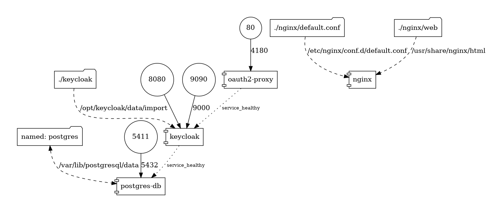
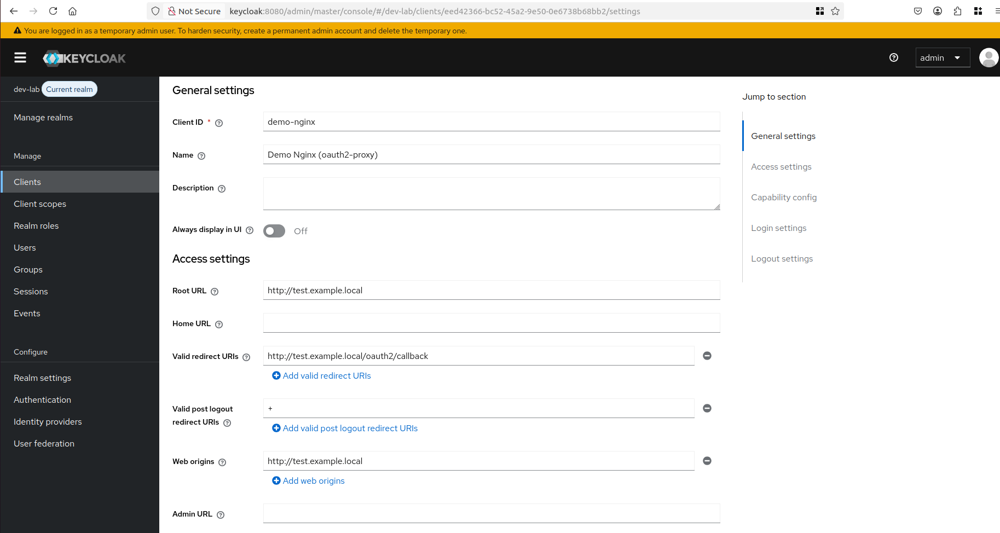
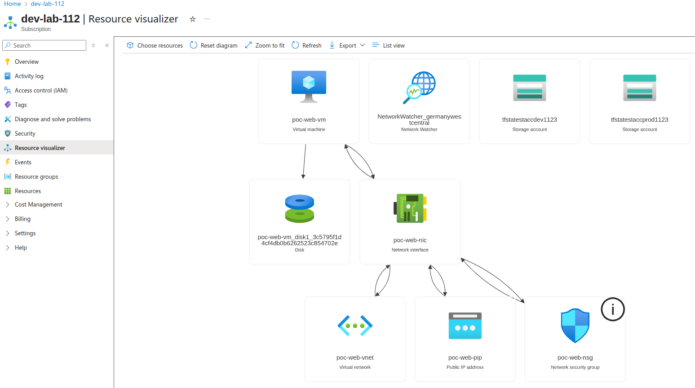
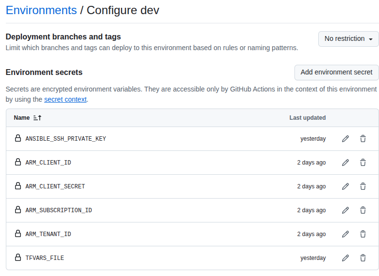

## DEV-LAB

### Local Development

[Docker Compose Docs](docker/DOCKER.md)  
* Docker Compose Graph  


<details>
  <summary><strong>Makefile</strong></summary>

```bash
help: 0. Show help for each of the Makefile recipes.
dc-up: 1. Start Docker Compose services
dc-down: 2. Stop Docker Compose services
dc-recreate: 3. Recreate Docker Compose services
tf-docs: 4. Generate Terraform documentation
tf-graph: 5. Generate Terraform graph visualization
tf-vars-b64: Encode Terraform variable file to Base64. Used for GitHub Secrets. Example: make tf-vars-b64 ENV=prod
```
</details>

<details>
  <summary><strong>Reasoning Behind the Architecture</strong></summary>
The components were created to fulfill the project requirement to deploy a Keycloak container with an attached PostgreSQL database and a web server serving a static web page protected by Keycloak authentication.  
PostgreSQL and Keycloak were selected to meet this specification and provide a reliable identity and data management layer.  
Nginx was chosen to host the static website, as it offers a natural and efficient fit for lightweight containerization.  
OAuth2 Proxy was introduced to handle authentication and authorization flows without the need to implement additional JavaScript logic, leveraging an existing, well-tested solution for secure access control.
</details>

### Keycloak setup proccess
<details>
  <summary><strong>Keycloak steps</strong></summary>
The process I followed when creating the Keycloak realm was as follows:

Initially, I generated a basic realm configuration using AI to serve as a foundation.  
After importing it into Keycloak, I manually adjusted the necessary values and settings.  
Once the configuration was finalized, I exported the realm, cleaned up unnecessary IDs and metadata, and used this sanitized version for automated realm creation first in the local environment, and later deployed to the server using Ansible.  
* Keycloak Client  

</details>

### Terraform
* Terraform Workflow Commands
```bash
terraform -chdir=infra/terraform init -reconfigure -backend-config=backend/dev.backend.conf

terraform -chdir=infra/terraform plan -var-file=dev.tfvars

terraform -chdir=infra/terraform apply -auto-approve -var-file=dev.tfvars

terraform -chdir=infra/terraform destroy -auto-approve -var-file=dev.tfvars
```
<details>
  <summary><strong>Azure and Github TF</strong></summary>
Subscription Resources



Github Secrets

</details>

[Pre Setup](bin/README.md)  
[Terraform-docs](infra/terraform/TF_DOCS.md)  
[TF VM Azure](https://registry.terraform.io/providers/hashicorp/azurerm/latest/docs/resources/linux_virtual_machine)
### Ansible
To configure and deploy the environment using Ansible, run the following command:
```bash
ansible-playbook -i infra/ansible/inventory/hosts.yaml infra/ansible/setup-full.yaml
```
[Ansible Docs](infra/ansible/ANSIBLE_DOCS.md)

### Refs

[Keycloak Realm](https://www.keycloak.org/getting-started/getting-started-docker)  
[Keycloak](https://www.keycloak.org/documentation)  
[Oauth2](https://oauth2-proxy.github.io/oauth2-proxy/)  
